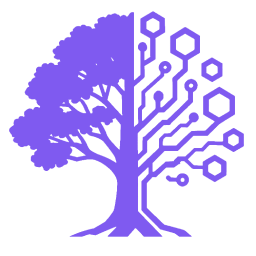

<p align="center">
  
</p>

<h1 align="center">Quickdraw</h1>

<p align="center">
  <strong>The realtime fullstack starter for <a href="https://github.com/fitzzero/quickdraw">@fitzzero/quickdraw-core</a></strong><br />
  Typed Socket.IO services, two-tier ACL, a full auth suite, and a multiplayer game foundation — already wired together.
</p>

<p align="center">
  <a href="https://quickdraw.techtree.gg"><strong>▶ See it live → quickdraw.techtree.gg</strong></a>
</p>

<p align="center">
  <a href="https://github.com/fitzzero/quickdraw-chat/actions/workflows/ci.yml"></a>
  <a href="https://www.npmjs.com/package/@fitzzero/quickdraw-core"></a>
  
</p>

---

This repo is three things at once:

1. **A production-ready template** — fork it, run one script, and start on the interesting part of your app.
2. **The reference implementation** for quickdraw-core's patterns: services, ACL, subscriptions, **collections**, channels, auth.
3. **A working demo** — a realtime chat app _and_ a multiplayer Godot snake game sharing one typed API. [Play it.](https://quickdraw.techtree.gg/game)

## Live lists in one declaration

The heart of quickdraw 4.0: a **collection** is "rows of this service,
grouped by a scope id derived from the row". Declare it once server-side and
every list UI gets live deltas, pagination, reconnect re-snapshots, and ACL —
no hand-typed `*:created`/`*:deleted` events, no `staleTime: 0` refetching,
no merge/dedupe state.

```typescript
// apps/api/src/services/message/index.ts — the chat's message history
this.defineCollection("byChat", {
  resolveScopeId: (message) => message.chatId, // membership is a pure function of the row
  checkScopeAccess: (userId, chatId) => this.checkChatAccess(userId, chatId, "Read"),
  snapshot: (chatId, { cursor, limit }) => this.byChatSnapshot(chatId, { cursor, limit }),
});
// this.create()/this.delete() now emit added/removed deltas automatically
```

```tsx
// apps/web/src/components/chat/ChatWindow.tsx — the whole client
const {
  items: messages,
  hasMore,
  loadMore,
} = useCollection<MessageDTO>("messageService", "byChat", chatId, { compare: compareByCreatedAt });
```

The template demonstrates both scope shapes end to end:

| Collection                | Scope                            | Shows off                                                                                                                                                                                                                                        |
| ------------------------- | -------------------------------- | ------------------------------------------------------------------------------------------------------------------------------------------------------------------------------------------------------------------------------------------------ |
| `messageService` `byChat` | chat id                          | Fully automatic deltas from the CRUD trio; unbounded history (no `ids`) with `loadMore` cursor paging                                                                                                                                            |
| `chatService` `myChats`   | **user id** (`string[]` fan-out) | Scopes aren't only parent entities: one chat fans out to every member's list. Manual choke points for junction-table writes + cascade-safe delete; snapshot `ids` prune offline deletions; cross-service `lastMessageAt` refresh via write hooks |

## What you get

- **Typed realtime services** — `BaseService` + `defineMethod()`: request/response over Socket.IO, zod-validated, ACL-gated, consumed through typed React hooks (`useServiceQuery`, `useService`, `useSubscription`) with TanStack Query caching. Services declare wire DTOs (`TDto` + `toDto`).
- **Live collections** — `defineCollection` + `useCollection` power the chat sidebar and message history (see above), plus write lifecycle hooks and typed room events (`QuickdrawEventMap`).
- **Two-tier access control** — service-level roles (`Public/Read/Moderate/Admin`) plus per-entry ACLs, shown in both flavors: membership table (`ChatService`) and JSON ACL (`DocumentService`). Enforced server-side on every method, subscription, collection, and channel.
- **A multiplayer game foundation** _(optional — carve it out in one command)_ — Godot 4 client with a first-party GDScript Socket.IO client, 20Hz fire-and-forget input channels, client-side prediction + reconciliation, snapshot interpolation, server-side NPC AI, guest play, live leaderboards, and React overlays (pre-game dialog, HUD, chat) driving the same typed API as the game engine.
- **Auth, all of it** — Google + Discord OAuth, revocable DB sessions in httpOnly cookies, **mock OAuth** for zero-credential local dev, **guest sessions** for anonymous play, a **Discord Activity** embed, and dev-credential flows for the Godot editor. Dev flags hard-block production boot. Socket auth is shaped as core's `createQuickdrawServer` hooks.
- **Generic admin dashboard** — every service gets a CRUD surface at `/admin` for free; the game's tunables (`DefinitionService`) are edited live in the browser.
- **MCP server** — every service method exposed as an MCP tool over stdio (`.mcp.json` wired for Claude Code).
- **Dual-mode testing** — the same integration suite runs on in-memory PGlite locally (no PostgreSQL, seconds) and real PostgreSQL in CI, with seeded users, factories, and socket test helpers.
- **CI/CD included** — migration drift checks, cached lint/typecheck/build, sharded tests, and a parameterized deploy workflow (TruffleHog → migrate → Cloud Run → Vercel).
- **Strict tooling, framework-synced** — oxlint extending quickdraw-core's shipped base config (plus a local custom-rule showcase), oxfmt, tsgo, turbo, bun. Claude Code rules in `.claude/rules/` load by path.

## Quick Start

```bash
# Start postgres (or point DATABASE_URL elsewhere via .env.local)
docker-compose up -d

# Install dependencies
bun install

# Generate Prisma client, apply migrations, seed demo users
bun run db:generate
bun run db:migrate
bun run db:seed

# Start development (env loads via scripts/load-env.sh — no .env setup needed)
bun run dev
```

Open http://localhost:3000 → **Continue as demo user** → pick a seeded account
(admin@demo.local / moderator@demo.local / user@demo.local). No OAuth
credentials required in development.

## Using as Template

```bash
# 1. Clone (or use GitHub's "Use this template" / `tel project new`)
git clone https://github.com/fitzzero/quickdraw-chat my-new-project
cd my-new-project

# 2. One-shot initialize: renames databases, titles, deploy service name,
#    devcontainer, optional backend port and @scope — then deletes itself
./scripts/init-fork.sh my-new-project 4010
# options: ./scripts/init-fork.sh <app-name> [backend-port] [--scope @myorg] [--without-game]

# 3. Start developing
docker-compose up -d
bun run db:generate && bun run db:migrate && bun run db:seed
bun run dev
```

The script only rewrites app identity — framework references
(`@fitzzero/quickdraw-core`, `QuickdrawProvider`, …) are untouched.

**Not building a game?** `--without-game` removes the entire game foundation
(Godot app, GameService, DefinitionService, Discord Activity, guest auth,
scores) along marked seams, then verifies the carve-out builds clean.

### Set up without Conveyor compute

If this repo was generated by [Conveyor](https://conveyor.rallycryapp.com)'s
project wizard but you skipped compute setup (no agent to run the rename for
you), initialize it manually:

```bash
git clone <your-new-repo> && cd <your-new-repo>
./scripts/init-fork.sh <your-project-name>
git add -A && git commit -m 'chore: initialize from template' && git push
```

Then follow the Quick Start above. Your Conveyor board works against the repo
either way — the rename just fixes package/database/display names.

**What's already configured:** strict linting (extending quickdraw-core's
shipped base + custom local rules), unit/integration test lanes, CI with
migration drift checks, a parameterized deploy workflow (Cloud Run + Vercel),
Dockerfiles, mock OAuth dev login, Claude Code rules + hooks, shared Conveyor
workflow skills (`@rallycry/conveyor-skills`, symlinked into `.claude/skills/`
and refreshed on every install via the `prepare` script), and a
conveyor-ready devcontainer (`.devcontainer/conveyor/`) so the repo passes
conveyor's project readiness checks immediately.

**Connecting a fork to Conveyor:**
[docs/conveyor-setup.md](docs/conveyor-setup.md) is the end-to-end journey —
project creation, the two Compute commands, MCP hookup for a local Claude
session, prebake, and the branch contract.

**Faster agent boots (optional):** Conveyor can prebake the agent image via a
GitHub Actions workflow it generates and commits for you — no GCP account
needed, and it can run on your own self-hosted runner. Nothing to implement in
this repo: flip it on in Conveyor's project settings when you want it. See
[docs/conveyor-prebake.md](docs/conveyor-prebake.md) for what gets generated
vs configured, plus a minimal shape illustration of the workflow.

## Project Structure

```
.
├── apps/
│   ├── api/              # Express + Socket.io server
│   │   └── src/
│   │       ├── services/     # User, Chat, Message, Document, Game, Definition
│   │       ├── auth/         # OAuth (google/discord/mock), guest, JWT, middleware
│   │       └── __tests__/    # Integration tests + factories
│   ├── web/              # Next.js frontend (MUI, dark-tokyo theme)
│   │   └── src/
│   │       ├── app/          # App router: landing, chats, game, scores, admin
│   │       ├── components/   # React components (landing, chat, game overlays)
│   │       ├── hooks/        # Typed wrappers for quickdraw-core hooks
│   │       └── providers/    # QuickdrawProvider, ThemeProvider
│   ├── game/             # Godot 4 project (exports into apps/web/public/game)
│   └── bench-web/        # Browser viewer for netcode benchmark runs
├── packages/
│   ├── db/               # Prisma schema, migrations, client, seed
│   ├── shared/           # Shared types (ServiceMethodsMap), room helpers
│   └── bench/            # Netcode benchmark scenarios + scoring
├── docs/                 # Deployment, PWA, netcode, Conveyor guides
├── .claude/              # Claude Code rules + hooks
├── .devcontainer/conveyor/ # Conveyor agent devcontainer (codespace-ready)
└── .github/workflows/    # ci.yml, parameterized deploy.yml, conveyor-prebake.yml
```

## Services

| Service         | Purpose                    | ACL Pattern                                 | Collections             |
| --------------- | -------------------------- | ------------------------------------------- | ----------------------- |
| UserService     | User profile management    | Self-access (override `checkAccess`)        | —                       |
| ChatService     | Chat rooms with membership | Membership table (`checkEntryACL` override) | `myChats` (user-scoped) |
| MessageService  | Real-time messaging        | Inherits from parent chat                   | `byChat` (chat-scoped)  |
| DocumentService | Document collaboration     | JSON ACL (default `checkEntryACL`)          | —                       |

Cross-service helpers (auth guards, pagination, schema builders) live in
`apps/api/src/services/shared/`.

## MCP Server

`apps/api/src/mcp-server.ts` exposes every service method as an MCP tool over
stdio (core's `McpRegistry` + `createMcpStdioServer`). The root `.mcp.json`
registers it for Claude Code — build once (`bun run build`), and the server
runs through `scripts/load-env.sh` so it sees the same database as `bun run
dev`. Run it manually with `bun run mcp` from `apps/api`.

<!-- ── quickdraw-game:start ── -->

| Game service      | Purpose                                          | ACL Pattern                                  |
| ----------------- | ------------------------------------------------ | -------------------------------------------- |
| GameService       | Multiplayer sim, high scores, input channel      | Public-read world + room-gated input channel |
| DefinitionService | Data-driven game content (tunables, live-edited) | Public read, admin write                     |

## Game Foundation

The template ships a working multiplayer game: a Godot 4 client
(`apps/game/`, embedded at `/game`) playing a slither-style snake in one
global world, with real netcode (client-side prediction + reconciliation,
snapshot-buffer interpolation), server-side NPC snakes, a first-party
GDScript Socket.IO client, guest sessions for anonymous play, a public
high-scores page (`/scores`), DOM overlay HUD + game-server chat, DB-driven
tunables editable in the admin UI, and a Discord Activity entry at `/discord`.

- Patterns: `.claude/rules/game-patterns.md` (channels vs methods, ordering
  contract, sim purity) and `apps/game/README.md` (editor setup, dev auth,
  export, Discord).
- Game commands are ordinary quickdraw methods — a React button and the Godot
  client call them identically; only tick-rate traffic uses channels
  (quickdraw-core ≥3.8). The pre-game dialog is the showcase: React drives
  the world Godot renders, through the same typed, ACL'd API.
- **Not building a game?** `./scripts/init-fork.sh <name> --without-game`
removes all of it (or run `node scripts/strip-game.mjs` standalone).
<!-- ── quickdraw-game:end ── -->

## Development

> Always use `bun run <script>` (never bare `bun <script>` — that invokes
> bun's built-ins instead of the turbo-routed package scripts).

```bash
# Development
bun run dev           # Start all apps in dev mode
bun run reset:dev     # Clean slate: ff-only update to origin/dev (RESET_BRANCH overrides), clear build caches, reinstall, rebuild, migrate + seed

# Building
bun run build         # Build all packages
bun run typecheck     # tsgo type check all packages

# Linting and formatting
bun run lint          # oxlint across all packages (extends quickdraw-core's base config)
bun run lint:fix      # Fix lint issues
bun run format        # oxfmt auto-format
bun run format:check  # Check formatting
bun run check         # lint + typecheck

# Testing
bun run test          # All tests (unit + integration)
bun run test:unit     # Unit tests only (no database)
bun run test:int      # Integration tests (PGlite locally, PostgreSQL when TEST_DATABASE_URL is set)
bun run test:coverage # With coverage

# Database
bun run db:generate   # Generate Prisma client
bun run db:migrate    # Create + apply a migration (required for schema changes)
bun run db:seed       # Seed demo users/chat/document (idempotent)
```

### Tooling

| Tool   | Purpose                            |
| ------ | ---------------------------------- |
| Bun    | Package manager and script runner  |
| oxlint | Linting (replaces ESLint)          |
| oxfmt  | Formatting (replaces Prettier)     |
| tsgo   | Type checking (replaces tsc)       |
| Turbo  | Monorepo build orchestration       |
| Vitest | Testing (unit + integration lanes) |

### Adding a New Service

1. Create the service in `apps/api/src/services/<name>/index.ts`
2. Define types as a new module in `packages/shared/src/types/` and register
   it in `types/service-methods.ts`
3. Register in `apps/api/src/index.ts`
4. Write integration tests

See `.claude/rules/service-architecture.md` for detailed patterns.

## Environment

Layered loading via `scripts/load-env.sh` (used by `bun run dev` and db scripts):

1. `.env.infra` — checked-in dev defaults (DB URL, ports, URLs, dev flags)
2. optional secrets layer — commented hook for your secret manager
3. `.env.local` — your secrets & overrides, gitignored

See `env.example` for the secrets that belong in `.env.local`
(`JWT_SECRET`, `ENCRYPTION_KEY`, `ADMIN_EMAILS`, real OAuth credentials).
Real env vars (e.g. CI) always take precedence.

## Authentication

- **Mock OAuth (dev only)**: `ENABLE_MOCK_OAUTH=true` (default in `.env.infra`)
  serves a real OAuth code flow from the API itself with a seeded-user picker.
  Hard-blocked in production (the API refuses to boot with the flag set).
- **Google / Discord OAuth**: configure credentials in `.env.local`; flows are
  built on core's providers with CSRF state cookies and a shared callback
  (`apps/api/src/auth/oauth-callback.ts`).
- **Sessions**: JWT + database session row (revocable) carried in an
httpOnly session cookie — the sole client credential (sockets and REST);
no token ever appears in URLs or localStorage.
<!-- ── quickdraw-game:start ── -->
- **Guest sessions**: `POST /auth/guest` mints a real (marked `isGuest`) user
  - session so signed-out visitors can play the game; scores persist if they
    later log in. Rate-limited like the OAuth routes.
- **Dev credentials**: `ENABLE_DEV_CREDENTIALS=true` lets the Godot editor
authenticate as a seeded user during development — also hard-blocked in
production.
<!-- ── quickdraw-game:end ── -->
- **Bootstrap admin**: list emails in `ADMIN_EMAILS` to auto-promote to Admin.
- **Token encryption**: set `ENCRYPTION_KEY` (64-char hex) to encrypt stored
  OAuth tokens at rest (AES-256-GCM via core).

## Testing

Integration tests are dual-mode (see `.claude/rules/testing-patterns.md`):

- **Local (default)**: in-memory PGlite from a fingerprint-cached template —
  no PostgreSQL, full suite in seconds.
- **CI / real PostgreSQL**: set `TEST_DATABASE_URL`; each vitest worker gets
  its own database cloned from a migrated template DB.

Use `seedTestUsers()` and the factories in `apps/api/src/__tests__/factories/`
for data; `startTestServer()` + `connectAsUser()` for socket flows.

## Production Deployment

See [DEPLOYMENT.md](DEPLOYMENT.md). The short version: fill in the
placeholders in `.github/workflows/deploy.yml` + `apps/api/env.cloudrun.yaml`,
create the GitHub/GCP secrets it lists, and run the Deploy workflow
(TruffleHog scan → prisma migrate → Cloud Run API → Vercel web). Prefer
self-hosting? The Dockerfiles + `docker-compose.yml` cover that path too.

## License

MIT
